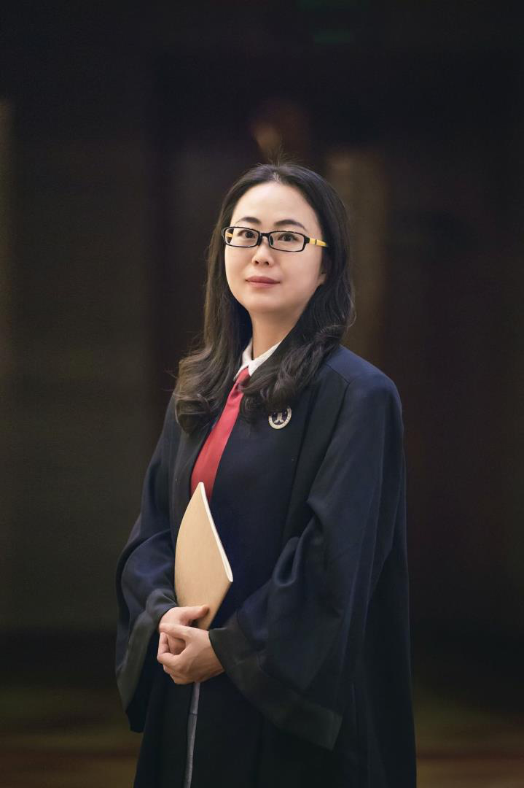

::: {.page-heading}
# 专业简介

以专业判断、审慎策略与持续服务，为客户提供稳定可靠的法律支持。

:::

::: {.two-column}
::: {.column-main}
包增春律师，法律硕士，二级高级律师，现为安徽云旗律师事务所合伙人、合肥市律谐调解中心理事。其执业方向涵盖劳动法、婚姻家事、民商事争议解决、破产清算、公司法律事务及常年法律顾问服务。

在长期执业过程中，包增春律师重视案件事实、证据体系与法律适用之间的严密衔接，强调以清晰的法律分析和可执行的解决方案维护当事人合法权益。

她曾获中央电视台、安徽电视台、合肥市广播电视台、安徽省律师协会、安徽司法、万家热线等多家新闻媒体专访，并获安徽商报、中安在线专题报道。
:::

::: {.column-side}
{fig-alt="包增春律师职业照"}
:::
:::

## 专业定位

::: {.service-grid}
::: {.service-card}
### 劳动法与用工合规
处理劳动争议、用工风险防控、劳动合同、竞业限制及企业合规管理相关法律问题。
:::

::: {.service-card}
### 婚姻家事法律服务
处理婚姻、继承、家庭财产、离婚纠纷及相关民事法律事务。
:::

::: {.service-card}
### 民商事争议解决
处理合同纠纷、公司纠纷、债权债务、侵权责任等民商事案件。
:::

::: {.service-card}
### 破产清算与公司事务
提供破产清算、企业治理、公司法律顾问及相关专项法律服务。
:::
:::

## 执业理念

法律服务不仅是对法律条文的适用，更是对事实、证据、风险和现实目标的综合判断。包增春律师坚持以客户合法权益为核心，在案件处理中追求专业、稳健、有效的解决路径。
